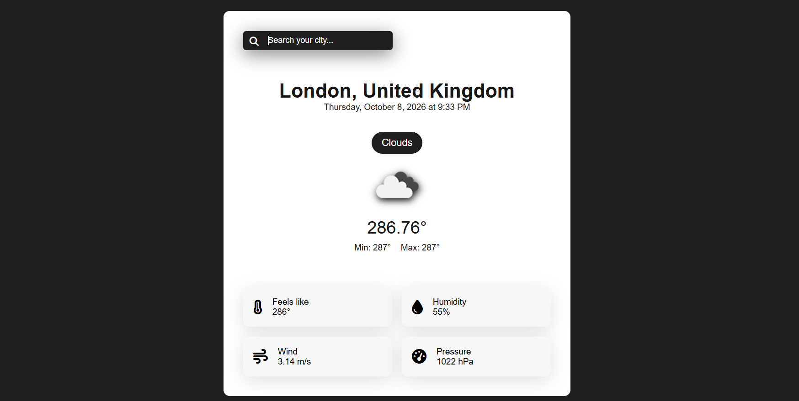

# 🌤️ Weather Application

A simple weather application built using **HTML, CSS, and JavaScript** that fetches and displays current weather information using the **OpenWeather API**.

## ✨ Features

* 🔍 Search weather by city name
* 🌍 Display city and country
* 📅 Display date and time
* 🌤️ Display current weather condition and icon
* 🌡️ Display current, minimum, and maximum temperature
* 🌡️ Display feels-like temperature
* 💧 Display humidity
* 💨 Display wind speed
* 🎚️ Display atmospheric pressure

## 🛠️ Technologies Used

* HTML5
* CSS3
* JavaScript
* OpenWeather API
* Font Awesome
* JavaScript Internationalization API (`Intl`)

## 📁 Project Structure

```text
Weather Application/
│
├── index.html
├── style.css
├── app.js
├── config.js              # API key (ignored by Git)
├── config.example.js      # Configuration template
├── preview.png
├── .gitignore
└── .gitattributes
```

## 🔑 API Configuration

1. Create a free API key from OpenWeather.
2. Add your API key in `config.example.js`.
3. Rename it to config.js.

## ▶️ How to Run

1. Clone the repository:

```bash
git clone https://github.com/stutigupta1503/Weather-Application.git
```

2. Follow the [API Configuration](#-api-configuration) steps above.

3. Open `index.html` in your browser.

## 📸 Preview



## 👩‍💻 Author

**Stuti Gupta**

* GitHub: https://github.com/stutigupta1503
* LinkedIn: https://www.linkedin.com/in/stuti-gupta1503/
